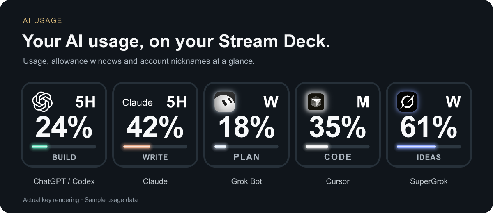

# AI Usage

**Your AI subscription usage, on your Stream Deck.**



_Rendered by the plugin using sample data._

Keep the accounts and allowance windows you check within sight. AI Usage displays supported subscription readings on Stream Deck keys, with account nicknames, used or remaining percentages, custom colors, and reset countdowns when the source provides them.

An open-source plugin with multiple keys, supported accounts, and custom colors included. Provider subscriptions and compatible sign-ins are required where applicable.

## Release status

This repository contains the full-featured plugin source. Preview installers are available through [GitHub Releases](https://github.com/3Fold-Labs/ai-usage-streamdeck/releases). Read the release notes for verification results and remaining platform-acceptance limits. See [known limitations](docs/KNOWN-LIMITATIONS.md) for source and platform constraints.

The maintainer reports successful installation and use in the Stream Deck app on macOS. Physical Stream Deck hardware and Windows have not been verified for this preview. Review the documented limitations before installing.

## What it does

- Multiple usage keys and supported accounts, including multiple accounts from the same service where the connection supports it.
- Account nicknames to distinguish similar-looking keys.
- Separate available short-term and weekly allowance windows.
- Used or remaining percentages, plus available reset countdowns on key press.
- Custom key/background colors and palettes.
- Cursor Models and Other Models allowance views.
- Explicit unavailable and stale states: a missing reading is not treated as zero usage.

## Supported sources

| Integration     | Source and scope                                                                                                                                                          |
| --------------- | ------------------------------------------------------------------------------------------------------------------------------------------------------------------------- |
| ChatGPT / Codex | Account-rate-limit windows returned by a compatible signed-in Codex app-server. Coverage follows the source response; this is not a promise to cover every ChatGPT quota. |
| Claude          | Local Claude Desktop subscription-usage history and optional Claude Code exporter. Available reset timestamps depend on the source.                                       |
| Grok Bot        | Subscription allowance reported by the signed-in desktop integration.                                                                                                     |
| Cursor          | Included usage for Cursor Models or Other Models on the active account. On-demand spending is excluded.                                                                   |
| SuperGrok       | Subscription allowance reported through the signed-in Grok CLI integration. Separate from Grok Bot.                                                                       |

Each provider has its own limits. The plugin does not combine them into a shared balance, increase allowances, or provide general API billing reports. Some connections depend on provider interfaces that can change.

## Compatibility and setup

The manifest requires Stream Deck 7.1+, macOS 13+ or Windows 10+. Compatibility also depends on the installed Stream Deck version and each provider's application. This plugin uses keys, including keys on Stream Deck +; it does not implement dial or Neo Infobar actions.

1. Download `3FoldLabs-AI-Usage.streamDeckPlugin` from the preview release Assets on [GitHub Releases](https://github.com/3Fold-Labs/ai-usage-streamdeck/releases), then open it to install in Stream Deck. Source ZIPs are not installers.
2. Add an AI Usage action to a key.
3. Follow the [connection guide](docs/CONNECTIONS.md) for the provider. Sign in through its app or CLI and explicitly enable integrations that require it.
4. Choose the account, nickname, available window, display mode, and colors.

For local development, use Node.js 24 and run:

```sh
npm ci --ignore-scripts --no-audit --no-fund
npm run check
npm run build
npm run build:check
npm test
npm run pack
```

`npm run pack` produces the unrestricted plugin as `dist/3FoldLabs-AI-Usage.streamDeckPlugin`. The plugin UUID is `com.3foldlabs.ai-usage`.

Do not replace a working installation just to test a source change. Use a separate test setup and back up the Stream Deck profile first.

## Privacy and cleanup

Usage is processed locally or retrieved directly from the selected provider. There is no 3Fold-hosted usage collection service. The usage adapters are designed to avoid collecting prompts or conversation contents.

Provider tools can store their own local authentication. Account labels, cached readings, and managed sign-in folders can persist locally. The optional Claude exporter changes status-line configuration. Native Stream Deck uninstall does not currently guarantee restoration of that configuration or removal of all managed data. See [privacy](docs/PRIVACY.md) and [known limitations](docs/KNOWN-LIMITATIONS.md).

## Contributing and support

Bug reports should include OS, Stream Deck/plugin versions, provider, and reproduction steps. Remove emails, account IDs, credentials, raw provider responses, and private usage from logs or screenshots before sharing. See [contributing](CONTRIBUTING.md) and [security reporting](SECURITY.md).

## Project structure

```text
src/
  plugin.ts       Stream Deck entrypoint
  runtime/        Store, keys, sessions and action handlers
  providers/      Provider adapters and credential readers
  inspector/      Settings UI, styles and feature modules
  generated/      Generated artwork data
  *.ts            Shared domain logic, rendering and service
scripts/          Build, structure and release checks
test/             Synthetic unit and packaged-runtime tests
com.3foldlabs.ai-usage.sdPlugin/
                  Manifest and generated installable plugin
```

See [Contributing](CONTRIBUTING.md) for module boundaries, generated files and required checks.

## License and independence

AI Usage is provided "as is" under the [MIT License](LICENSE). Use it at your own risk. Usage readings may be delayed, incomplete, or inaccurate, and provider changes may interrupt compatibility. Verify important usage and billing details directly with the provider. You are responsible for your accounts, credentials, backups, and compliance with provider terms. The MIT License sets out the warranty disclaimer and limitation of liability.

Third-party notices are preserved in [THIRD-PARTY-NOTICES.md](THIRD-PARTY-NOTICES.md). The code license does not grant rights to third-party trademarks or artwork.

AI Usage is independently developed by 3Fold Labs. It is not affiliated with, sponsored by, endorsed by, or an official product of Elgato, OpenAI, Anthropic, xAI, Anysphere, or their services. Third-party names and artwork identify compatible services only. Their inclusion is not a recommendation or promotion of those brands. All trademarks belong to their respective owners. Claude is identified with ordinary text only.
